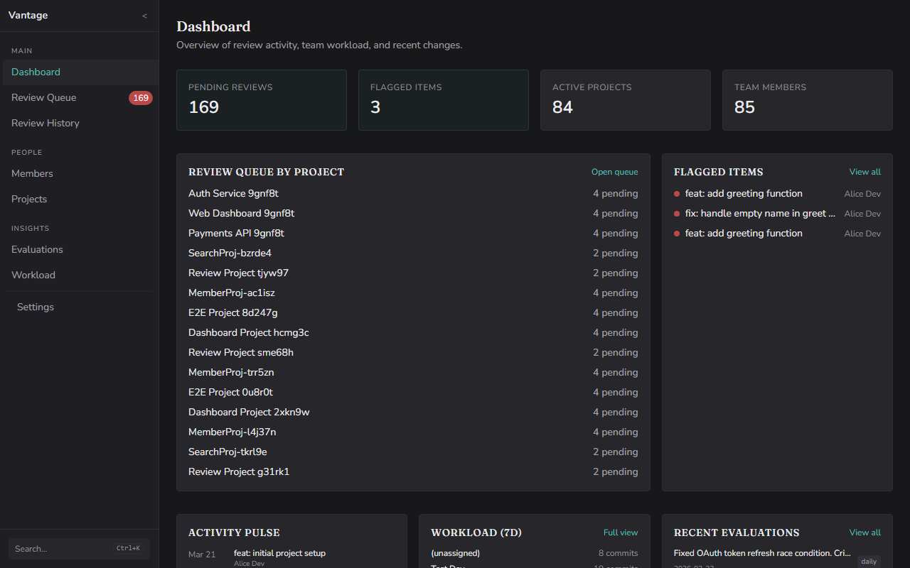
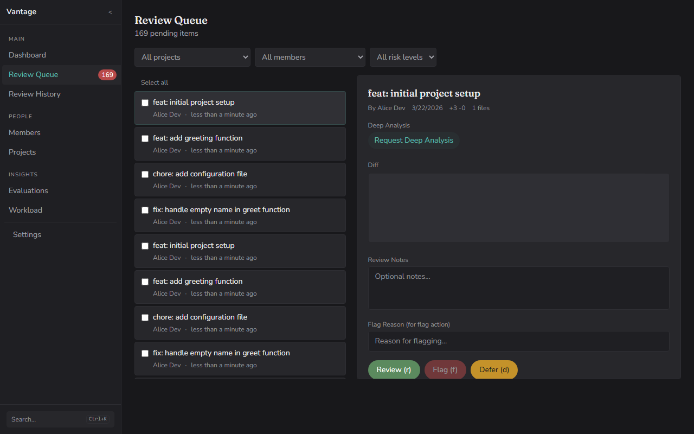
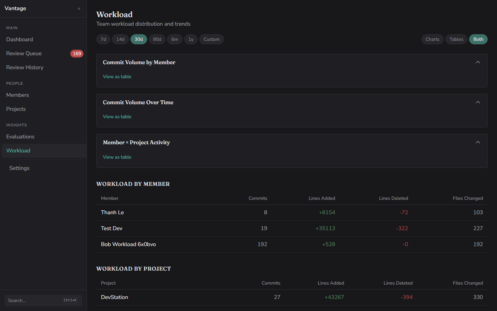

# Vantage

**A local-first review dashboard for dev leads who manage code across GitHub, GitLab, Bitbucket, and Gitea.**



You're the person responsible for code reviews — whether that's one large project or a dozen across multiple platforms. Things fall through the cracks. Your evaluations live in a spreadsheet, disconnected from the code activity that drives most of their content.

**Vantage fixes this.** [Get started in 4 commands.](#quick-start)

## What it does

- **Unified review queue** — Every commit, PR, and MR in one place — whether you manage one repo or twenty. Nothing goes unreviewed.
- **Smart triage (optional)** — AI-generated summaries, risk levels, and categories. Flags a public API change buried in a 400-line refactor, or a new query missing parameterized inputs.
- **Identity resolution** — Maps GitHub usernames, GitLab handles, and commit emails to real people. Matches are suggested based on name and email similarity; you confirm each before it takes effect. Your team member who commits as three different emails? One person, one view.
- **Evaluations from review activity** — Daily check-ups and quarterly reviews, pre-filled by AI from your accumulated reviews. Generate drafts for your entire team in one pass — you add the 20% that requires human observation.
- **Workload visibility** — Charts showing who's doing what, across which projects, over time.
- **Local-first** — Reads from your local `.git` directories. Your code and evaluations never leave your machine.

> Vantage is not a task tracker or a CI/CD tool — it's a review dashboard and evaluation tool for the person who reviews the code. (Task tracker integration surfaces Jira/ClickUp metadata alongside code changes, but Vantage doesn't manage tasks.)

## Quick start

**Requirements:** [Node.js 20+](https://nodejs.org/), [pnpm](https://pnpm.io/installation) (`npm install -g pnpm` if you don't have it), git. Works on macOS, Linux, and Windows.

> **Note:** pnpm is required — Vantage uses pnpm workspaces. `better-sqlite3` is a native module; if `pnpm install` fails, you may need C++ build tools ([Windows](https://visualstudio.microsoft.com/visual-cpp-build-tools/), macOS: `xcode-select --install`, Linux: `build-essential`).

```bash
git clone https://github.com/ThanhWilliamLe/vantage.git
cd vantage
pnpm install
pnpm build && pnpm start
```

Open [http://localhost:24020](http://localhost:24020). Add your repo paths in Settings → Projects, then scan.


## See it in action

### Review Queue
Every code change across your projects. AI summaries tell you what changed at a glance. Risk badges flag what needs real attention.



### Workload Charts
Commit volume by member and project. Spot imbalances before they become problems.



## Features

### Nothing slips through
- Cross-platform review queue — GitHub, GitLab (including self-hosted), Bitbucket Cloud, and Gitea
- Commit-level and PR/MR-level review units — review the way you actually review
- Age tracking — stale items surface, nothing hides
- Multi-branch awareness — see work across all branches, not just main
- Review workflow: pending → reviewed / flagged → communicated → resolved — completion guarantee your notifications tab can't give you
- Incremental scanning — only fetches new commits, fast on daily use
- Git worktree support — works with repos that use `git worktree`

### Focus on what matters
- AI summaries, categories, and risk levels auto-generated on scan
- On-demand deep analysis with repo context — reads your source files for richer insights
- Task cross-referencing — regex-detected Jira/ClickUp IDs become clickable links
- Optional task enrichment — connect Jira/ClickUp API to see task title, status, and assignee inline (requires API credentials)
- Full-text search across all code changes and evaluations

### Evaluations write themselves
- Daily check-ups — AI pre-fills from that day's review activity
- Quarterly reviews — AI summarizes months of review activity into a draft evaluation
- Workload scoring with historical tracking
- CSV export and historical data import from existing spreadsheets

### Your data stays yours
- Runs on your machine — no cloud, no SaaS, no accounts
- Reads from local `.git` directories
- SQLite database — single file, easy to back up
- Full backup and restore (JSON export/import)
- API tokens encrypted at rest (AES-256-GCM)
- Open source (Apache 2.0) — read every line

## How it works

Vantage is a local web server (Fastify) serving a React frontend. It reads commits directly from your local git repos using `simple-git`. Optionally, connect platform API tokens to enrich commits with PR/MR metadata.

```
Your local .git repos
    ↓
Vantage (localhost:24020)
    ├── SQLite (your data)
    ├── AI provider (optional — for triage + evaluation pre-fill)
    ├── Git platform APIs (optional — for PR/MR metadata)
    └── Task tracker APIs (optional — for Jira/ClickUp enrichment)
```

No data leaves your machine unless you configure an external API connection.

## AI setup

Vantage works without AI — you get the review queue, workload charts, and evaluation log regardless. AI is optional and adds automatic triage and evaluation pre-fill.

**Supported providers:**
- **Claude** (Anthropic) — API or CLI
- **OpenAI** — API
- **Any OpenAI-compatible API** — custom endpoint

Configure in Settings → AI Provider. AI triage sends commit diffs and messages to your configured provider — no code is sent without AI enabled.

## Updating

```bash
cd vantage && git pull && pnpm install && pnpm build && pnpm start
```

Your SQLite database and settings are preserved across updates.

## Tech stack

| Layer | Technology |
|-------|-----------|
| Backend | Fastify, TypeScript, Drizzle ORM |
| Frontend | React 19, TanStack Router + Query, Tailwind CSS, Recharts |
| Database | SQLite (better-sqlite3) |
| Git | simple-git (reads local repos) |
| AI | Anthropic/OpenAI API, or Claude CLI |
| Monorepo | pnpm workspaces |

## Contributing

Contributions welcome. Please open an issue first to discuss what you'd like to change.

```bash
# Development (two terminals)
pnpm dev              # Backend (watch mode)
pnpm dev:frontend     # Frontend (Vite dev server with HMR)

# Or: stable backend without watch (recommended on Windows)
pnpm --filter @twle/vantage-backend dev:stable

# Testing
pnpm test             # All tests (backend + frontend)
pnpm test:e2e         # Playwright E2E tests

# Quality
pnpm typecheck        # TypeScript check
pnpm lint             # ESLint
```

## License

[Apache 2.0](LICENSE)

---

Built for dev leads who review code across platforms. [Star the repo](https://github.com/ThanhWilliamLe/vantage) if this solves a problem you have.
